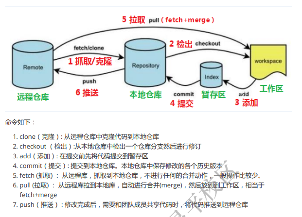
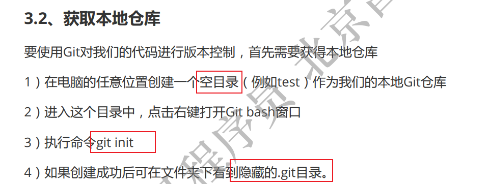
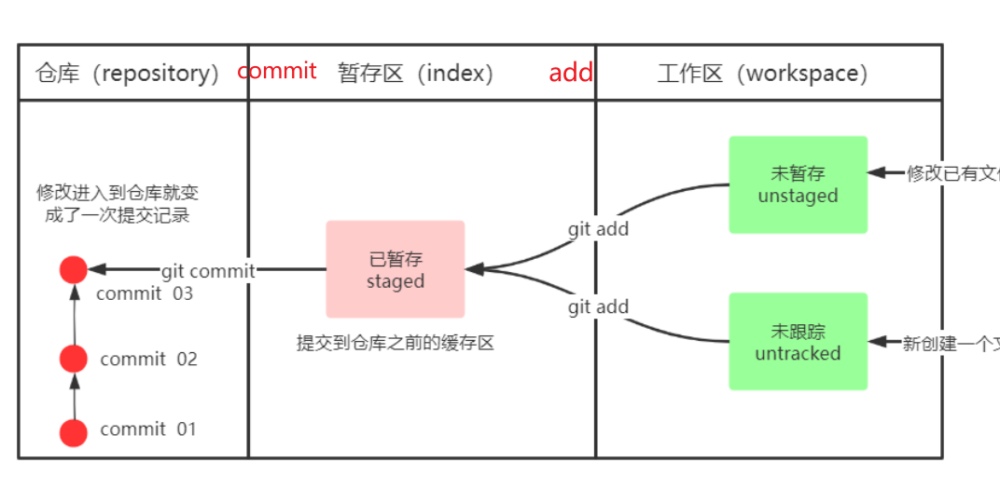
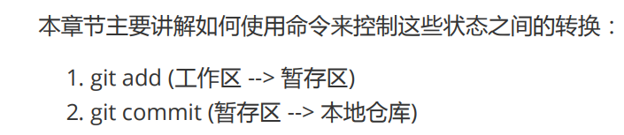
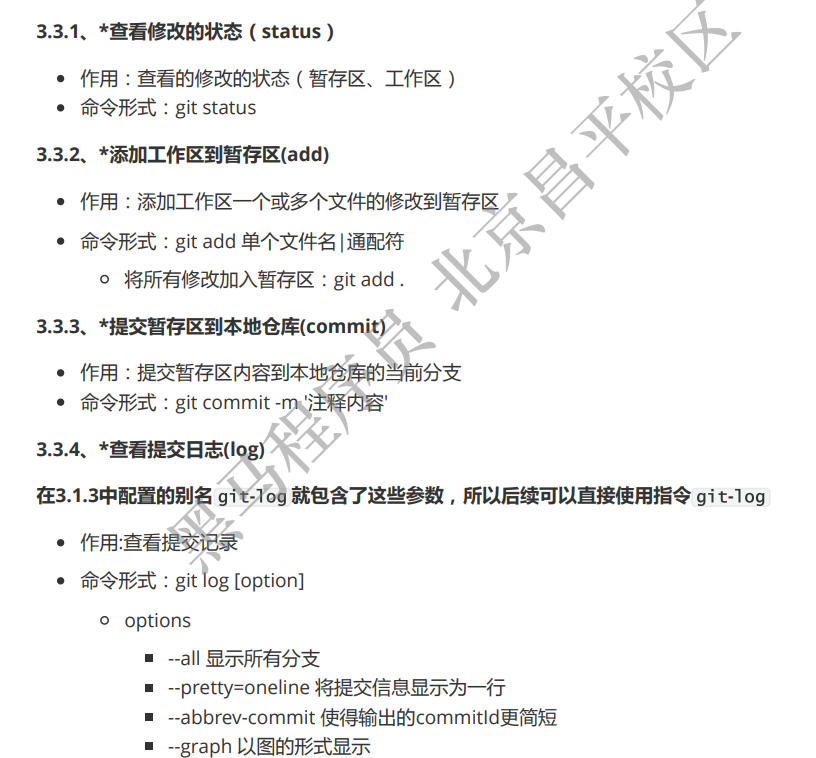
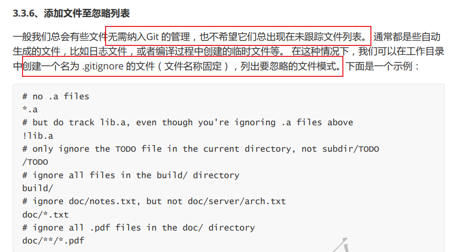

## 开发中的实际场景：
1. 备份
2. 代码还原
3. 协同开发
4. 追溯问题代码的编写人和编写时间
## 版本控制器的方式
1. 集中式版本控制工具（SVN CVS）已经过时了
2. 分布式版本控制工具(Git)


- Git GUI：Git提供的图形界面工具
- Git Bash：Git提供的命令行工具

## 基本配置
1. 打开Git Bash
2. 设置用户信息 \
git config --global user.name "lulin" \
git config --global user.name"lulinfan0514@gmail.com" \
查看配置信息  \
git config --global user.name \
git config --global user.name

3. 为常用指令设置别名
打开用户目录，创建.bashrc文件
touch ~/.bashrc
```
#用于输出git提交日志
alias git-log='git log --pretty=oneline --all --graph --abbrev-commit'
#用于输出当前目录所有文件及基本信息
alias ll='ls -al'
```
打开gitBash，执行 source ~/.bashrc







版本回退
git reset --hard commitID
commitID 可以使用 git-log 或 git log 指令查看

git reflog
这个指令可以看到已经删除的提交记录

