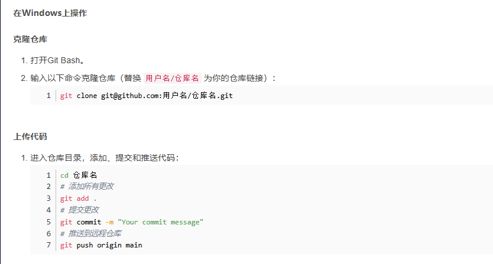
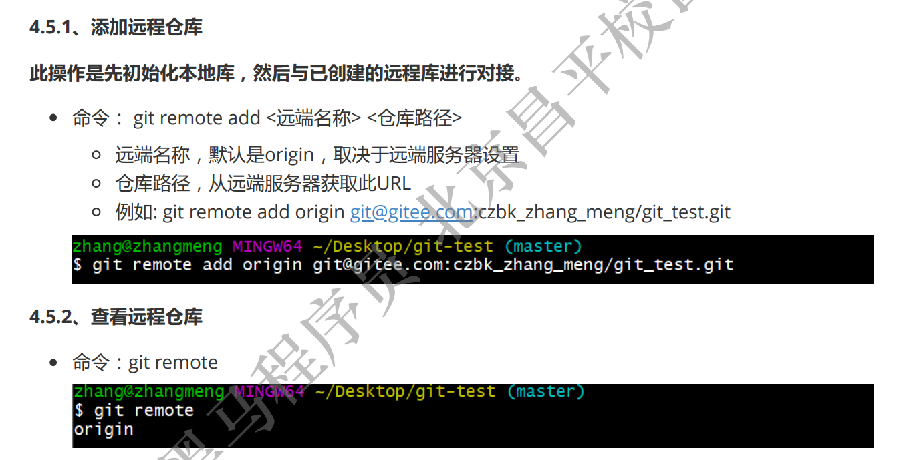
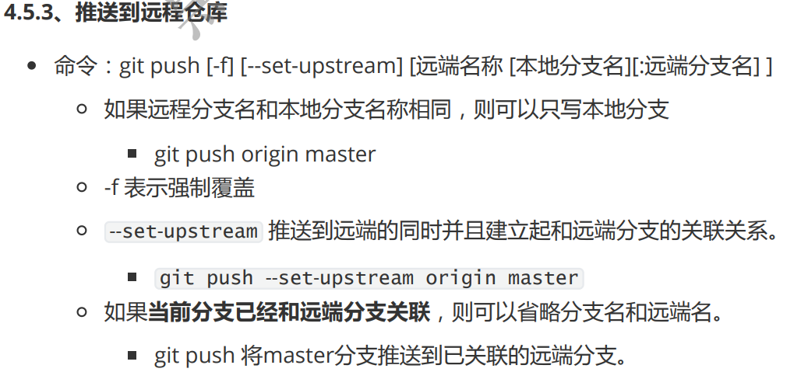
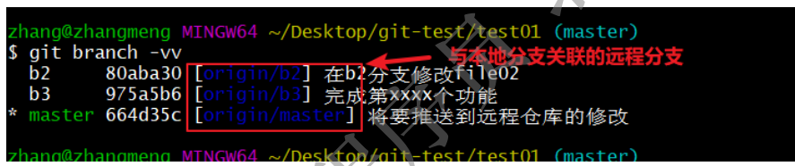

1. github上创建一个空的仓库
2. 配置公钥SSH （https://blog.csdn.net/g310773517/article/details/139729558）
3. 克隆和上传仓库

注意：git默认是master分支，GitHub默认是main分支，所以，我们在打开本地仓库时可以先切换分支git checkout -b main

本地分支与远程分支的关联关系
git branch -vv
