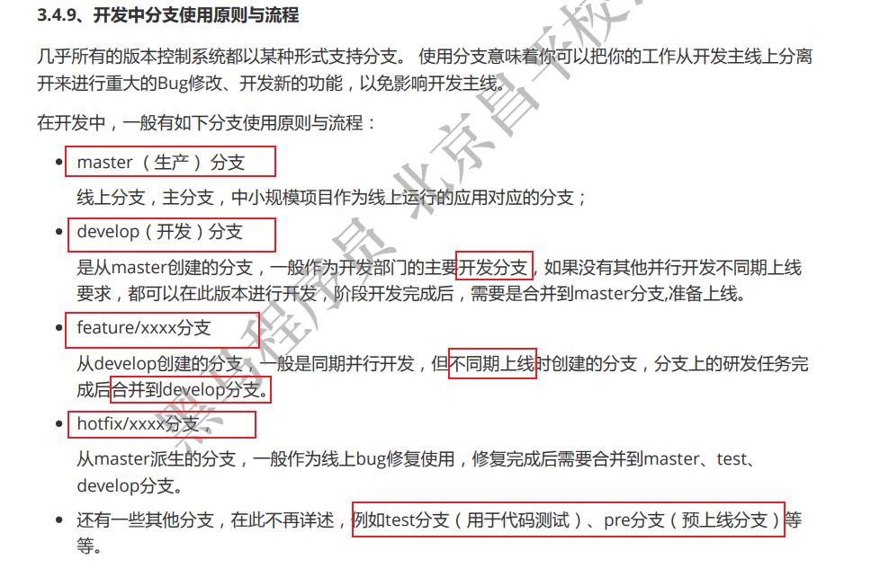
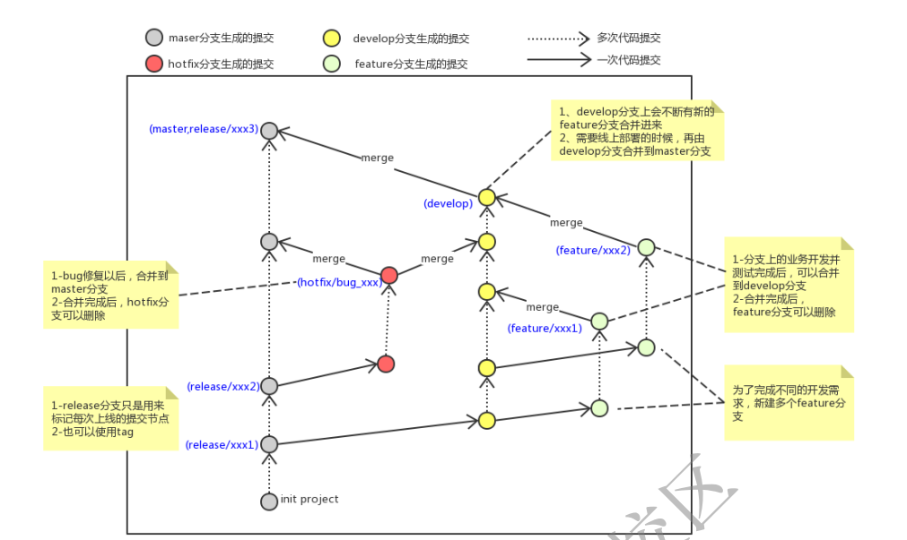

1. 查看本地分支：git branch
2. 创建本地分支：git branch 分支名
3. 切换分支：    git checkout 分支名 \
   我们还可以直接切换到一个不存在的分支（创建并切换）
   命令：git checkout -b 分支名
4. *合并分支(merge) \
    一个分支上的提交可以合并到另一个分支 \
    命令：git merge 分支名称
5. 删除分支
    不能删除当前分支，只能删除其他分支 \
    git branch -d b1 删除分支时，需要做各种检查 \
    git branch -D b1 不做任何检查，强制删除 




```
…or create a new repository on the command line
echo "# git-test" >> README.md
git init
git add README.md
git commit -m "first commit"
git branch -M main
git remote add origin https://github.com/wind-waves-fll/git-test.git
git push -u origin main

…or push an existing repository from the command line
git remote add origin https://github.com/wind-waves-fll/git-test.git
git branch  main
git push  origin main
```