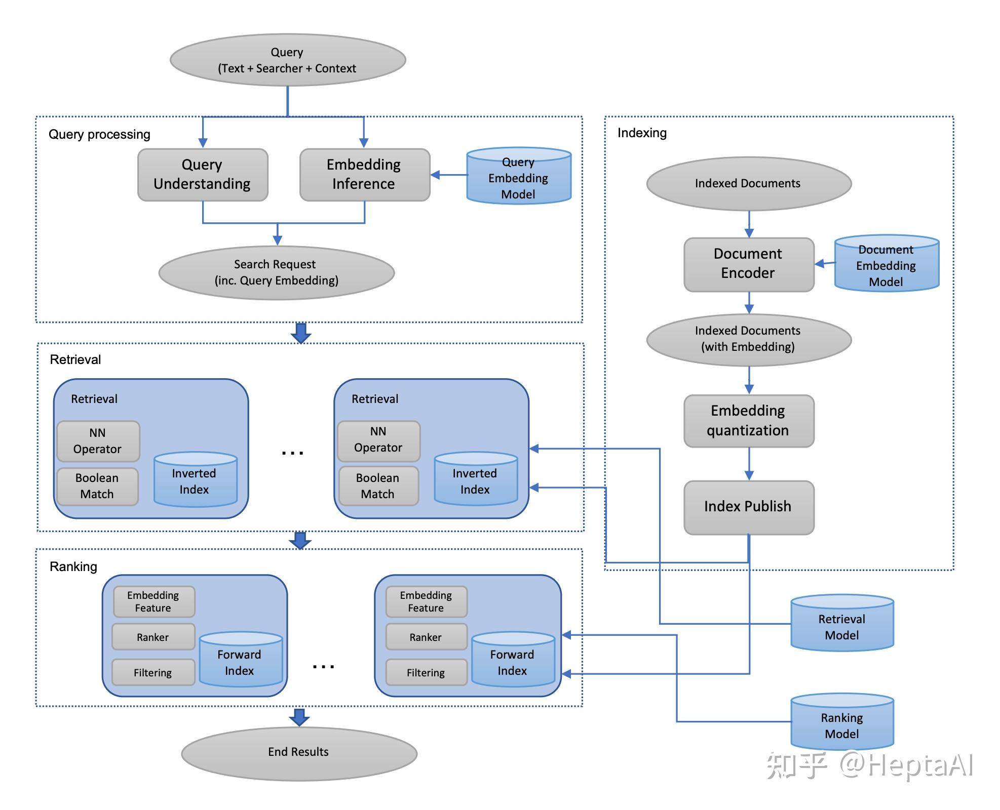

doi:https://arxiv.org/abs/2006.11632
# Embedding-based Retrieval in Facebook Search
## ABSTRACT
在社交网络例如Facebook面临着比web搜索不同的挑战：除了查询文本，考虑搜索者的内容去提供不同的结果也是十分重要的。
他们的社交图谱是这一背景的一个组成部分，是Fackbook搜索的一个独特方面。
基于嵌入的搜索已经被应用到eb搜索引擎许多年，Fackbook搜索仍然基于布尔匹配模型。
在本文，我们讨论将EBR技术应用到Fackbook搜索系统。
我们介绍了为个性化搜索建模语义嵌入而开发的统一嵌入框架，以及在一个典型的基于倒排序索引的搜索系统中服务于基于嵌入检索的系统。
我们讨论了整个系统端到端优化的各种技巧和经验，包括ANN参数调优和全栈优化。
最后，我们展示了我们在两个选定的关于建模的高级课题上的进展。
我们在Fackbook搜索的数据集上评估了EBR，在A/B实验中观察到了显著的指标增益。
我们相信，本文将提供有用的见解和经验，以帮助人们在搜索引擎中开发基于嵌入的搜索系统。

## 1 INTRODUCTION
搜索引擎已经成为一个重要的工具去帮助人们在网上获得巨大的信息。在过去的几十年各种技术不断地发展用来提高搜索质量，尤其是web引擎如Bing和Google。
从查询文本中很难精确的匹配搜索者的意图和表示文档的语义含义，搜索技术大多基于各种术语匹配方法，对于关键词匹配能够解决的情况表现很好。
但语义匹配仍然是一个具有挑战性的问题，其目的是解决与查询文本不完全匹配但能满足用户搜索意图的结果。

在过去几十年，深度学习已经在语音识别，计算机视觉和自然语言处理取得了重大的成果。其中，嵌入也称为表示学习，已经被证明是有助于成功的技术。
本质上，嵌入是一种将ID的稀疏向量表示为稠密特征向量的方法，也称为语义嵌入，因为它经常可以学习到语义。
一但嵌入被学习，它可以作为查询和文档的表示，应用于搜索引擎的各个阶段。
由于该技术在计算机视觉，推荐系统等其他领域的巨大成功，作为下一代搜索技术，已经称为信息检索界和搜索引擎行业的一个活跃的研究课题。

一般来说，搜索引擎包括一个召回层，其目标是以低延迟和计算成本检索一组相关的文档，通常称为检索
一个精确层，其目标是用更复杂的算法或模型对最需要的文档进行排名，通常称为排名。
虽然嵌入可以应用到两个层，但通常在检索层有更多的机会利用嵌入，因为它处于系统的最底层，通常是瓶颈。
嵌入在检索中的应用通常称为嵌入式检索，简称EBR。
简而言之，基于嵌入的检索是一种利用嵌入表示查询和文档，然后将检索问题转化为嵌入空间中的最近邻（NN）检索问题。

由于考虑的数据规模巨大，EBR在搜索引擎中是一个具有挑战性的问题。
与排序层通常在每个会话中考虑成百上千的文档不同，检索层需要在搜索引擎的索引中处理数十亿或数百亿的文档。
巨大的规模对嵌入的训练和嵌入的服务都提出了挑战。
其次，与计算机视觉任务中基于嵌入的检索不同，搜索引擎通常需要将基于嵌入的检索和基于术语匹配的检索结合到一起，以便在检索层对文档进行评分。

Fackbook搜索作为一个社交搜索引擎，相较于传统搜索引擎有着独特的挑战。在Fackbook搜索中，搜索者的意图不仅依靠于查询文本，但是也受到发布查询
的用户和搜索者所在的上下文的严重影响。因此，Fackbook搜索中基于嵌入的检索并不仅仅是一个文本嵌入问题，代替的是，它是一个更加复杂的问题，包含
了文本理解，用户和上下文一起。

为了在Facebook搜索中部署基于嵌入的检索，我们开发了一些方法来解决建模、服务和全栈优化方面的挑战。
在建模中，我们提出了统一嵌入，这是一个双面模型，其中一面是包括查询文本、搜索者和上下文的搜索请求，另一面是文档。
为了有效地训练模型，我们开发了从搜索日志中挖掘训练数据并从搜索者、查询、上下文和文档中提取特征的方法。
为了快速模型迭代，我们在离线评估集上采用了召回度量来比较模型。

为搜索引擎建立检索模型有其独特的挑战，例如如何为模型建立一个具有代表性的训练任务以有效地学习。
我们研究了两个不同的方向，一个是硬挖掘，以有效地解决表示和学习检索任务的挑战。
另一个是集成嵌入，以将模型划分为多个阶段，每个阶段都有不同的回忆和精度权衡。

在开发了模型之后，我们需要开发方法，以便在检索堆栈中有效地为模型服务。虽然构建一个结合现有检索和嵌入KNN的候选者的系统很简单，但我们发现它是次优的，因为几个原因：
1）从我们的初始实验来看，它具有巨大的性能成本；
2） 由于双重指标，维护成本高；
3） 两个候选集合可能具有显著的重叠，这使得其总体上效率低下。
此后，我们开发了一个混合检索框架，将嵌入KNN和布尔匹配集成在一起，为检索文档打分。为此，我们使用Faiss[9]库嵌入矢量量化，并将其与基于倒索引的检索相结合，构建了一个混合检索系统。
除了解决上述挑战外，该系统还具有两个主要优点：
1）能够实现嵌入和术语匹配的联合优化，以解决搜索检索问题；
2）它支持嵌入受项匹配约束的KNN，这不仅有助于解决系统性能成本问题，而且提高了嵌入KNN结果的精度。

搜索是一个多阶段的排名系统，其中检索是第一阶段，然后是排名和过滤模型的各个阶段。为了全面优化系统以返回那些新的好结果并最终抑制那些新的坏结果，我们进行了后期优化。
特别是，我们将嵌入纳入排名层，并建立了一个训练数据反馈回路，以积极学习从基于嵌入的检索中识别那些好的和坏的结果。
图1是基于嵌入的检索系统的示意图。我们在Facebook搜索的垂直领域评估了EBR，在在线A/B实验中观察到了显著的指标增益。

本文组织如下。
我们从建模开始，在第2节和第3节中介绍我们关于损失函数、模型架构、训练数据和特征工程的解决方案。
接下来，我们将在第4节中讨论有关模型服务和系统实现的细节。
我们在第5节中讨论了我们在后期优化中开发的技术，以释放基于嵌入的端到端检索的力量。
最后，我们将第6节专门介绍有关高级建模技术的选定主题。
然后在第7节中得出结论。

## 2 MODEL

